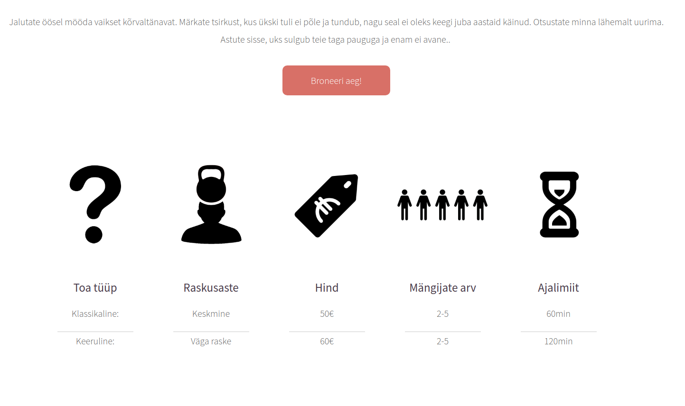
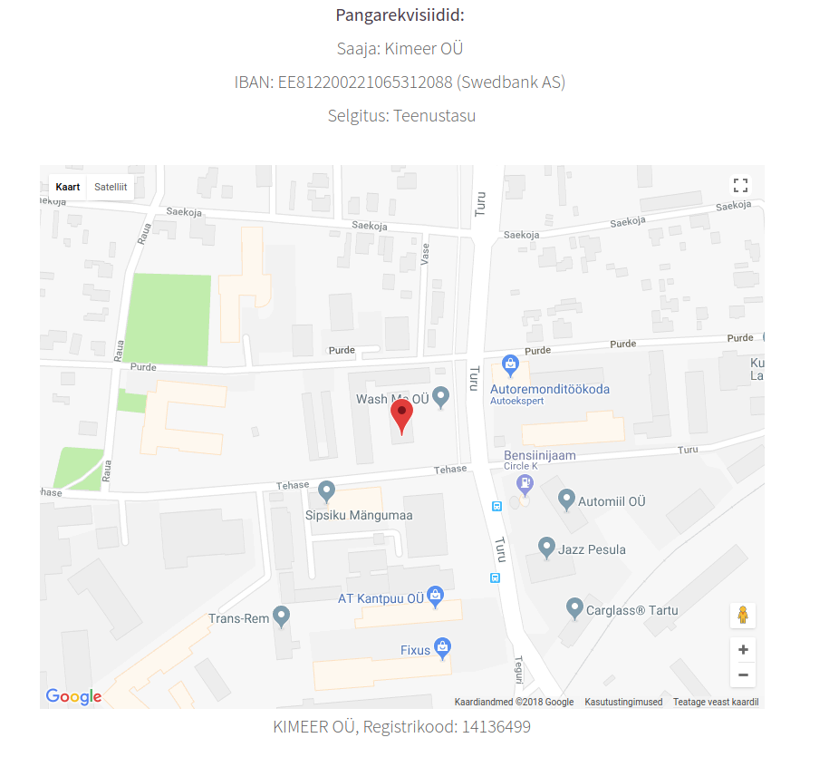

# noescape.ee

noescape.ee is a static web page created in order to provide information about the
escape room called NoEscape located in Estonia. It is also possible to make bookings
via the web page and find contact information about the escape room.

## Web page structure

The web page consist of the following pages:
* Home page
  * Introduction
  * General information
  * Clients' feedback
* Rules page
* Booking page
  * The bookings were done using external service provider called 
  [Sagenda](https://www.sagenda.com/)
* FAQ page
* Contact page
  * Information regarding contact
  * Interactive Google Maps add-on
* Every page also consisted of header and footer
  
## Installation

The installation requires simply copying the files in the [src](src)
folder into the web
server where they will be served.

## Some images from the web page

